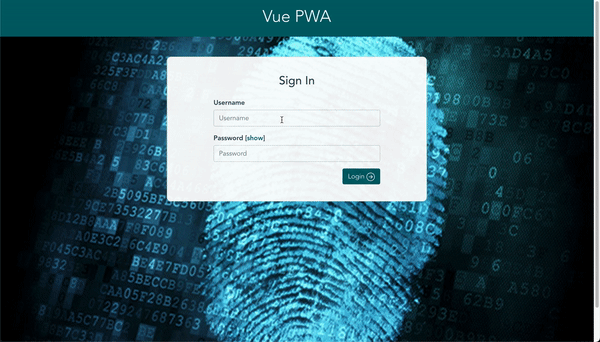

# drf-vue-boilerplate
django-rest-framework vue boilerplate with JWT authentication

## Local setup
#### Local setup with docker: backend and pwa
```bash
docker-compose up --build
```

#### Local setup without docker
- [Backend/API server setup](./backend/README.md)
- [PWA setup](./pwa/README.md)

## Features
### Backend / API server
- Auth user model
- Environment based project settings: make use of `DJANGO_ENV` environment variable to use different [settings -> ref](./backend/Backend/settings/__init__.py)
- JWT based authentication: **Authorization** header expects as `Token <access_token>`, feel free to [change here](./backend/Backend/settings/environments/dev.py)
- Endpoints
  - User/Account model
    - `/v1/account/<username>/`: retrieve user data
    - `/v1/account/<username>/update/`: update user data
  - Token
    - `/v1/account/token/both/`: authenticate with `username` and `password`, obtain token pair i.e. `access_token` and `refresh_token`
    - `/v1/account/token/refresh/`: refresh access_token with refresh_token
- [Testing](./backend/apps/account/api/v1/tests) and code [coverage report](./backend/.reports/coverage.svg) with `pytest`
- Style guide enforcement with `flake8`
- Dockerized

 ### PWA: progressive web application
 - Secure authentication with `axios` [interceptor](./pwa/src/services/core/api.js)
 - Sign In
 - Sign Out
 - Profile update
 - Automatic pwa update notification via service-worker. Refs - [register-service-worker](./pwa/src/registerServiceWorker.js), [update-component](./pwa/src/App.vue), [mixin](./pwa/src/mixins/update.js)
 - [Bootstrap theming](./pwa/src/plugins/bootstrap/app.scss)
 - Built-in [production server](./pwa/server.js)
 - Dockerized

## Demo

